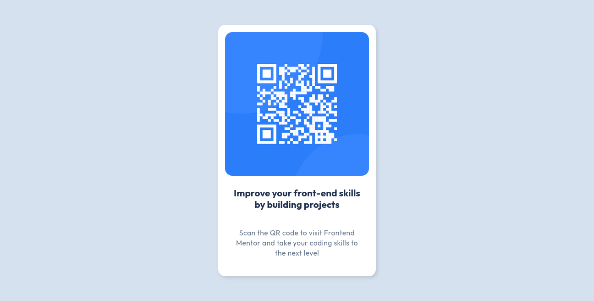

# Frontend Mentor - QR Code Component Solution

_A responsive HTML + CSS solution by Oscar Echenique_

This is a solution to the [QR code component challenge on Frontend Mentor](https://www.frontendmentor.io/challenges/qr-code-component-iux_sIO_H).

## Table of contents

- [Overview](#overview)
  - [Screenshot](#screenshot)
  - [Links](#links)
- [My process](#my-process)
  - [Built with](#built-with)
  - [What I learned](#what-i-learned)
  - [Continued development](#continued-development)
  - [Useful resources](#useful-resources)
- [Author](#author)
- [Acknowledgments](#acknowledgments)

## Overview

This challenge consisted of building a simple and responsive QR code card using only HTML and CSS. I followed a **mobile-first** approach and took this as an opportunity to dive deeper into semantic HTML, responsive design techniques, and modern CSS features.

It also marked an important milestone for me: I used **Git and GitHub** for version control in a real project for the first time.

### Screenshot



### Links

- Solution URL: [GitHub Repository - QR code component](https://github.com/OscarE2D/FrontendMentor-qr-code-component-main)
- Live Site URL: [GitHub Page - QR code component](https://oscare2d.github.io/FrontendMentor-qr-code-component-main/)

## My process

### Built with

- Semantic HTML5 markup
- CSS custom properties
- Flexbox
- CSS Grid
- Mobile-first workflow

### 📚 What I Learned

While working on this challenge, I faced several difficulties that turned into valuable learning experiences. One of the most interesting parts was diving deeper into the properties of the `` tag:

```html

```

Before, I only used `src` and `alt`, but this time I learned how other properties like `referrerpolicy` and `crossorigin` help protect information by preventing sensitive data from being sent in headers. I also discovered `loading="lazy"` and `decoding="async"`, which improve overall performance by allowing images to load more efficiently without blocking the page flow. Until now, I wasn’t very clear on how they worked, but I really enjoyed learning about their true purpose.

In terms of responsive design, I discovered how powerful `clamp()` can be. For example, I used `clamp(1rem, 1vw + 0.5rem, 1.375rem)` for font sizes and it worked like magic, eliminating the need for media queries and providing a more natural flow across different screen sizes.

I also made use of CSS custom properties (variables), which greatly help in keeping the code organized and make it easier to change certain values without having to search line by line. For the first time, I also wrote my own CSS reset, which was an enriching experience that helped me truly understand what each line does and how it affects the entire document.

Lastly, I want to highlight something very important: working with Git and GitHub. This was my first time uploading a complete project using version control, which was a personal challenge I had been meaning to tackle. Even though it wasn’t too complicated, it was essential to understand each command and its purpose in order to keep everything running smoothly.

### Continued development

After completing the challenge, I was left with a few important topics that I definitely need to explore further.

First of all, and to keep some order, I believe it’s essential to learn more about the properties of HTML tags and their main functions. Gaining a deeper understanding would help me improve both the performance and security of my pages—two aspects I hadn't paid much attention to before.

Secondly, I’d like to dive deeper into **CSS Grid**. While I managed to use it for layout purposes, I know it has much more potential. Mastering it would allow me to build more fluid structures and enhance the responsive design of my pages without relying so heavily on simpler solutions.

Lastly, another area I’m curious about is CSS functions. I’d like to identify how many there are, what they do, and how to make the most out of them. Sometimes we use them without really understanding their full potential, and I think dedicating time to this could really make a difference in future projects.

Considering the level of this challenge, these are the key questions and areas of curiosity I’m taking with me. They represent valuable opportunities to continue growing and improving as a developer.

### Useful resources

#### 1. **Git Immersion**

🔗 [https://gitimmersion.com/](https://gitimmersion.com/)
📘 _A practical, step-by-step guide to mastering Git._
This site goes beyond just listing commands — it walks you through practical exercises and real examples. Perfect for understanding not just the "how," but the "why" behind Git.

---

#### 2. **Modern HTML Explained For Beginners** – _by HTML Academy_

🔗 [https://htmlacademy.org/blog/html/semantic-html-guide](https://htmlacademy.org/blog/html/semantic-html-guide)
📘 _Explains how to use semantic HTML in modern development._
Focused on current best practices in HTML5, this guide shows how semantic tags improve SEO, accessibility, and clear structure. Great for strengthening your HTML fundamentals with a modern approach.

---

#### 3. **Every Layout – Intrinsic Design Patterns**

🔗 [https://every-layout.dev/](https://every-layout.dev/)
📘 _Teaches CSS design patterns with a functional and modern approach._
Learn to use tools like `clamp()`, `flex`, `grid`, and other advanced CSS features through a philosophy of simplicity and adaptability — without over-relying on media queries.

---

#### 4. **You Might Not Need JavaScript**

🔗 [https://youmightnotneedjs.com/](https://youmightnotneedjs.com/)
📘 _Shows how many common interactions can be achieved with just HTML and CSS._
A great resource for learning modern attributes and performance techniques. Helps you write simpler, lighter code by reducing unnecessary JavaScript usage.

## Author

- Website - [Oscar Echenique D.](https://github.com/OscarE2D)
- Frontend Mentor - [@OscarE2D](https://www.frontendmentor.io/profile/OscarE2D)
